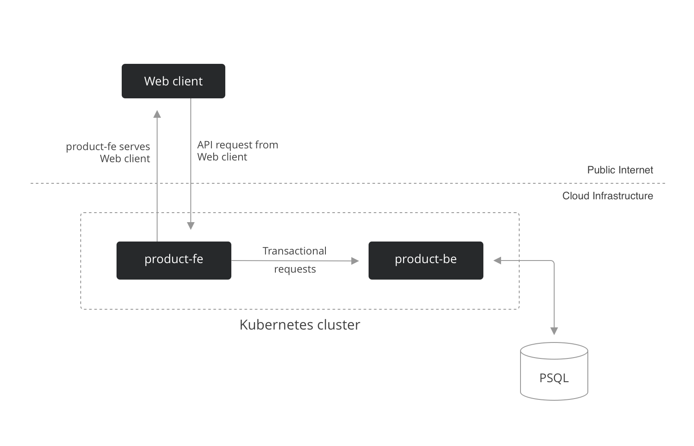

# product-be

This is a product listing back-end. It exposes an api on `/products` which can be used to add and list new product items. Products are stored in a single table in a Postgres database.

This package is intended to be used with the `product-fe` package.


## Configuration

The app accepts database configuration via these enviornmental variables:
| Variable | Description |
|--|--|
| `DATABASE_HOST` | The DNS name or IP of the Database server |
| `DATABASE_NAME` | The name of the database to connect to |
| `DATABASE_USER` | Username of ROLE with access to database defined in `DATABASE_NAME` |
| `DATABASE_PASSWORD` | Password for `DATABASE_USER` |
| `DATABASE_PORT` | (Optional) Port on the server defined by `DATABASE_HOST`. Defaults to `5432` |

## Running with docker-compose

The whole system can be run locally using `docker-compose`. This will run the `product-be` server and expose it on `localhost:8080`
and initialize a Postgres database which can be accessed on `localhost:5432`. The admin password to the database is
`pgsqlDev01`.

Run the following commands in the root of the repository:

```
$ docker-compose build
$ docker-compose up
```
## Running Locally

When running locally, you need to have a Postgres server up and running with a database created and with a Postgres ROLE that has `LOGIN` rights.

After that, the server can be run with the following command:
```
$ DATABASE_HOST="localhost" \
  DATABASE_NAME="product" \
  DATABASE_USER="product_robot" \
  DATABASE_PASSWORD="pr0dr0b0t" \
  node bin/www
```

Assuming the database server is running on `localhost` on `5432` with a database called `product` created by a user called `product_robot` with password `pr0dr0b0t`.
